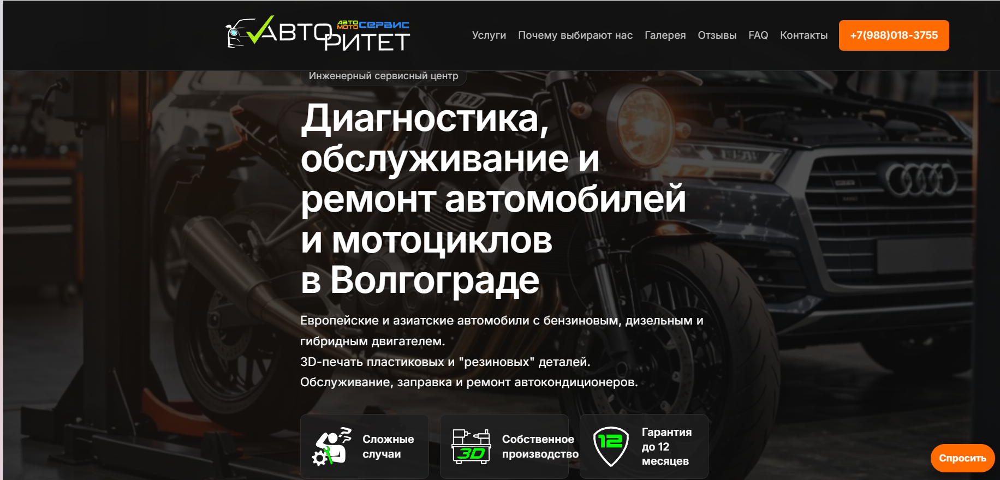
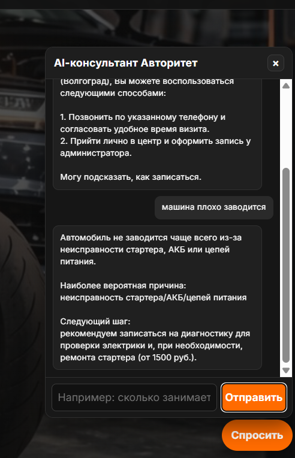
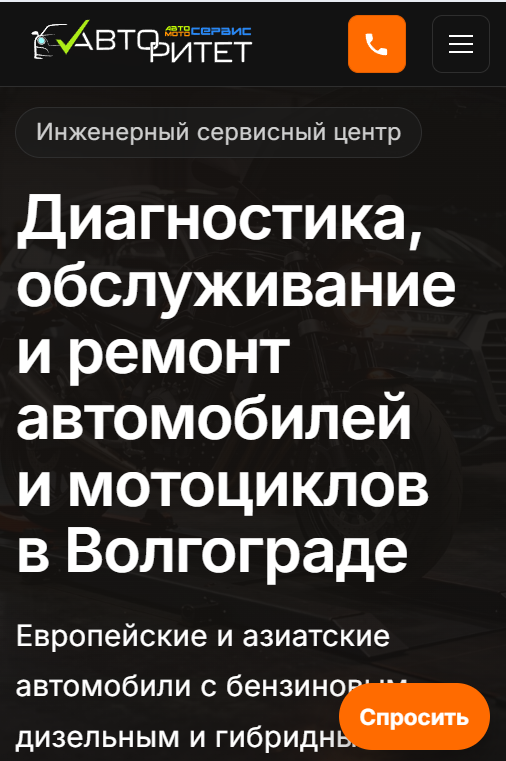

# AI-ассистент для автосервиса — Demo

Адаптивный сайт автосервиса с AI-чатботом, отвечающим на вопросы клиентов по услугам, ценам и записи. Бот работает на базе **GigaChat** (Сбер) + **RAG-архитектура** с векторным поиском по базе знаний.

**Версия:** Demo (упрощённая демонстрационная версия)
## 📸 Скриншоты





---

## 🔒 Demo version

This repository contains a simplified version of the system.
Full production version includes advanced RAG logic, hybrid search (BM25 + vector), embedding fallbacks, topic filtering, and production-grade optimizations.

**What's included in this demo:**
- Basic RAG pipeline (cache → vector search → GigaChat → answer)
- ChromaDB vector store with GigaChat embeddings
- Document processing (TXT, DOC, DOCX, XLS, XLSX, PDF, HTML)
- SQLite cache with TTL
- FastAPI backend with Pydantic validation
- Responsive frontend (dark theme)

**What's simplified:**
- Hybrid search replaced with vector-only search
- Advanced prompt engineering removed
- Embedding fallback mechanisms removed
- SSL certificate configuration simplified
- Topic filtering removed
- Retry logic and custom error handling removed

Full production version available on request.

---

## Быстрый старт

```bash
# 1. Клонируйте
git clone https://github.com/ВАШ_ПОЛЬЗОВАТЕЛЬ/avtoritet-bot.git
cd avtoritet-bot

# 2. Настройте бэкенд
cd backend
cp .env.example .env
# Отредактируйте .env — укажите GIGACHAT_AUTH_KEY и GIGACHAT_RQUID

# 3. Установите зависимости
python -m venv venv
source venv/bin/activate  # Linux/macOS
# или: venv\Scripts\activate  (Windows)
pip install -r requirements.txt

# 4. Запустите
python app.py
# или: uvicorn app:app --host 0.0.0.0 --port 8000
```

---

## Что реализовано

| Компонент | Описание |
|-----------|----------|
| **Адаптивный сайт** | 9 HTML-страниц с тёмной темой |
| **AI-чатбот** | Отвечает на вопросы по ремонту авто/мото, ценам, записи |
| **RAG-система** | Векторный поиск ChromaDB + GigaChat embeddings |
| **Поддержка форматов** | TXT, DOC, DOCX, XLS, XLSX, PDF, HTML |
| **Кеширование** | SQLite кеш с TTL |
| **Админ-панель** | Загрузка документов через API с токеном |

---

## Архитектура

```
avtoritet-bot/
├── frontend/
│   ├── *.html              # Страницы сайта
│   ├── css/                # Стили
│   └── js/                 # JavaScript
├── backend/
│   ├── app.py              # FastAPI
│   ├── .env.example        # Шаблон конфигурации
│   ├── requirements.txt
│   ├── assistant_giga/
│   │   ├── rag_pipeline.py     # RAG-пайплайн
│   │   ├── gigachat_client.py  # GigaChat клиент
│   │   ├── vector_store.py     # ChromaDB
│   │   ├── document_processor.py # Обработка документов
│   │   ├── cache.py            # SQLite кеш
│   │   └── prompt_template.txt # Prompt-шаблон
│   └── data/
│       └── sample_kb.txt       # Демо база знаний
└── docs/                       # Документация
```

---

## API

| Метод | Путь | Описание |
|-------|------|----------|
| `GET` | `/health` | Проверка здоровья |
| `POST` | `/api/chat/ask` | Вопрос к AI-ассистенту |
| `POST` | `/api/admin/documents/upload` | Загрузка документов |
| `GET` | `/api/admin/documents/tasks/{id}` | Статус задачи |

### Пример запроса

```bash
curl -X POST http://localhost:8000/api/chat/ask \
  -H "Content-Type: application/json" \
  -d '{"query": "Сколько стоит замена масла?", "use_cache": true}'
```

### Пример ответа

```json
{
  "answer": "Замена масла — от 500 руб. Точная стоимость зависит от марки авто.",
  "from_cache": false,
  "meta": {
    "model": "GigaChat",
    "retrieval": "vector",
    "top_k": 2
  }
}
```

---

## Стек

| Слой | Технологии |
|------|-----------|
| **Backend** | Python 3.10+, FastAPI, Uvicorn, Pydantic 2 |
| **AI** | GigaChat API (Сбер) |
| **Векторная БД** | ChromaDB |
| **Кеш** | SQLite (с TTL) |
| **Документы** | python-docx, pypdf, pandas, beautifulsoup4 |
| **Frontend** | HTML5, CSS3, Vanilla JS |

---

## Лицензия

MIT
